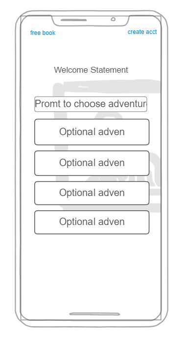

# mystartup
cs260 startup

##Elevator Pitch:
My startup will allow people who have never been exposed to the Book of Mormon to have a personal, self-guided experience in which they find answers to their pressing concerns. They will be prompted to both read and reflect on short, relevant passages that address their current needs. The goal is to let the truths speak for themselves and to organically generate interest in the Book of Mormon. Ideally, a person will walk away from that first interaction curious to learn what else the Book of Mormon contains. They will have the ability to request a personal copy or to meet with missionaries.  

###Key Features:
-Forward/Backward buttons guiding you through the experience
-Direct quotes/excerpts
-Illustrative Pictures
-Though provoking questions
-Share buttons: quote to social media or save it to their phone\n
-Request book\n
-Meet missionaries
-Write reflective journal entries
-A way to leave feedback about their experience. Rate?

###HTML
HTML structural and organizational elements will be used to create a seamless
and intuitive experience for users. Using html elements like header, section, and article 
to organize content like quotes, questions, journal entries, etc. 
Navigation elements like forward and backward buttons, with allow user control. We can also use
buttons for sharing or saving quotes.

###CSS
Layout will need to be visually appealing and engaging. Content like quotes, illustrations, photos, and nav
buttons will be well spaced, and adhere to an appealing color scheme. I want to pay special attention to the way
my application will appear on mobile devices. Most people will be finding this site through social media/web surfing.

###JAVASCRIPT
I want the user to be able to navigate through the application with the forward and back errors without having
major issues with screen reloads. JavaScript will manage user input for things like the journal entries.This web
app is really all about users pressing buttons because the whole idea is to create a self-guided/self-curated
experience. Buttons will be the basis for almost everything we do in this web app. 

###REACT
I should be able to use react to create forms for ordering books or scheduling meetings. It will also manage
real-time feedback and updates.

###WEB SERVICE
Web services will handle various user actions like placing an order for a book, scheduling an in-person meeting
with missionaries, and leaving feedback about their experience. 

###AUTHENTICATION
If a person wants to save their progress or their entries locally they can have the option to create a login.
This will make it so that activation energy stays very low for users with low levels of certainty. They only commit
after they have had an experience. So we will need some authentication to save their account info.

###DATABASE DATA
A database will be used to store and manage important data received from the user. Like if something was ordered
or scheduled. Inputs from the user will need to be stored so that if they return and log in, it will be there.

###WEBSOCKET DATA
I could use a websocket to give basic live updates to the user. At this point I'm not positive what all of these
different elements entail, but it looks like websockets can be used to enable real time communication and updates.
I guess this could be used to show users that their commands have been retrieved/processed. 

